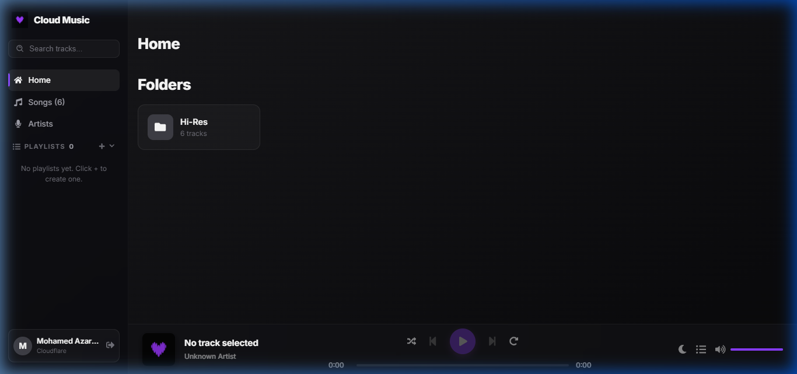

# Cloud Music Player (r2-music-player)

A modern, responsive web application for streaming music directly from Cloudflare R2 storage. Designed with a premium aesthetic and rich features for a seamless listening experience.

## 🖼️ Preview



## 🌟 Features

-   **Dynamic Ambient Background**: Uses current track art to create an immersive listening atmosphere.
-   **Fully Responsive Layout**: Left sidebar and main content grid adjust dynamically for all screen sizes.
-   **Now Playing Panel**: Comprehensive overlay detail for track info, volume control, & playback state.
-   **Audio Queues & Playlists**: Fully interactive queue with sleep timer support and context providers for global app-wide control.
-   **Equalizer Animation**: Visually reacts with audio playback to enhance look and feel.

## 🛠️ Technology Stack

-   **Frontend**: React 19 + Vite for extreme speed and HMR.
-   **Styling**: Vanilla CSS for smooth, tailored animations and high premium style benchmarks.
-   **Backend / Edge Functions**: Cloudflare Workers for processing streaming chunks or media ingestion template layouts.

## 🚀 Getting Started

To run the application locally:

1.  **Clone the repository** (or download workspace files).
2.  **Install dependencies**:
    ```bash
    npm install
    ```
3.  **Start Dev Server**:
    ```bash
    npm.cmd run dev
    ```
    *The app will be available at [http://localhost:5173](http://localhost:5173)*

---
